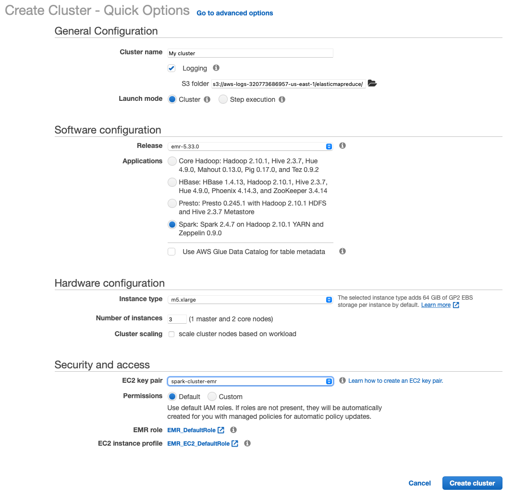

# Data Lakes

### Handling the data: Reading, Writing and Sorting

- [Explore Mapping and lazy evaluation in Spark (.ipynb file)](./0.1-SparkMapsAndLazyEvaluation.ipynb)
- [Reading and Writing To and From a Dataframe with Spark (.ipynb file)](./0.2-ReadWriteSparkDataframe.ipynb)
- [Data Wrangling with Spark (.ipynb file)](./0.3-SparkDataWrangling.ipynb)
- [Data Wrangling with SparkSQL (.ipynb file)](./0.4-SparkSQLDataWrangling.ipynb.ipynb)
- [Optimizing Data for Skewness Pandas & Spark (.ipynb file)](./0.5-OptimizingForDataSkewness.ipynb)
- [Schema on Read with Pandas & Spark | Adjusting the Schema & Data Types (.ipynb file)](./1.1-SchemaOnRead.ipynb)
- [Advanced Analytics NLP: Using Pandas, Spark and 3rd Party Spark JAR John Snow Labs (.ipynb file)](./2.1-AdvancedAnalyticsNLP.ipynb)

<hr>

### Data Lakes: S3 + Spark(Local) | Running Spark in Local Mode

Using python module pyspark to run spark on local computer. Run it either in Juypter Notebooks or in python scripts. 
** WARNING: DO NOT USE THIS WITH LARGE DATASETS

[Data Lake on S3 with Spark (.ipynb file)](./3.1-DataLakeOnS3.ipynb)
<hr>

### Data Lakes: S3 + Spark(EMR) | Creating an AWS EMR Cluster running Spark

<details>
  <summary>In the AWS Console</summary>
  
  - **AWS Console EMR Create Options**
  
</details>

<details>
  <summary>Command Via Terminal</summary>

```text
aws emr create-cluster \
--name spark-cluster \
--use-default-roles \
--applications Name=Spark Name=Zeppelin \
--release-label emr-5.20.0 \
--ec2-attributes KeyName=spark-cluster-emr,SubnetId=subnet-<Your SubnetId> \
--region us-east-1 \
--instance-groups '[{"InstanceCount":2,"InstanceGroupType":"CORE","InstanceType":"m5.xlarge","Name":"Core - 2"},{"InstanceCount":1,"InstanceGroupType":"MASTER","InstanceType":"m5.xlarge","Name":"Master - 1"}]' \
--log-uri <Path to Your S3 Logs>

# CHECK CLUSTER STATUS
aws emr describe-cluster \
--cluster-id <CLUSTER_ID FROM ABOVE>
```

</details>

<details>
    <summary>Copying data to EMR Cluster & Logging In SSH</summary>
  
- Run these commands in a terminal that's opened up from the folder contaning the Private AWS Key used to create the EMR cluster, otherwise modify the path to the .pem file.

```python
# Copy the Private Key to running EMR Cluster
scp -i spark-cluster-emr.pem spark-cluster-emr.pem hadoop@<Master public DNS>:/home/hadoop/
# Log into via SSH to the EMR cluster
ssh -i spark-cluster-emr.pem hadoop@<Master public DNS>
```

</details>

[Project: Deploying a Spark job both locally and in EMR. Creates an ETL pipeline reading data from S3 - Transforms Data - Saves back to S3. ](./ProjectFolder)
<hr>

### Data Lakes: S3 + Serverless(AWS Glue + Athena)
